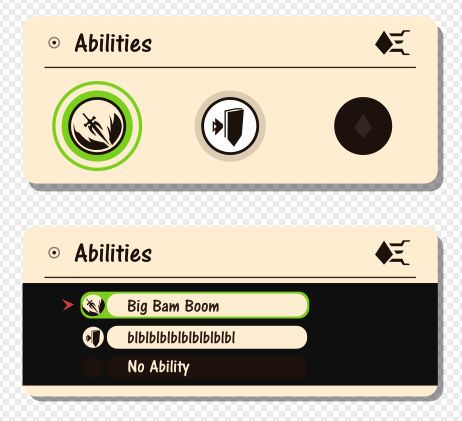

# PataNext Abilities V2
## Reasons
The current abilities concept of PataNext was to have an immense freedom for your character:
- You could attach up to 3 different abilities on each commands
- They could be accessed via 3 buttons (Up (W), Down (S), Horizontal (A, D))
- Each ability would cost an ability gem (that you could gain via leveling up)

The big problem with this concept was that it's hard to balance things out;  
How can we make the ability feels powerful, without it actually being powerful?  

There were some solutions to that:
- Add a cooldown, such as the ability could not be used until the cooldown is off (retriggering the ability would restart the cooldown).
- Require having enough summon energy and decrease it on each ability trigger

But of course, there would still be unbalancing problems;  
Even if we would make a super powerful ability with a cooldown of 1 minute, the enemies would have a hard time to telegraph it:
- It wouldn't be possible to know the abilities of an enemy before the match start
- It would be possible to mitigate it forcing the player to do a combo (such as prefixing it with the charge command), but
- The player can immediately switch to a non-powerful ability to bait the enemy; but then it would be way too much random to telegraph.

Another reason is how could we display the abilities in the menu?
- If they are abilities that just attach to one command, then we could do a menu for each possible commands with 3 abilities slots in it:
    - But what would happen if we wanted to add a similar command (such as Quick Defence); would it be another command, or would it take the same place as the Defense command?
- If they are abilities that attach to a combo and command, how would we display it? If abilities have their own unique combo, how should it be displayed before the user is able to add the ability?

Should Leaders of a squad have custom abilities? If leaders had abilities then it would be too much complex to remember them all, and the fight would be random (yes, it would be epic with some home made combos, but it's still somewhat random).

Abilities were also hero mode, so this mean they would have the same problems as normal abilities.

Because of all these problems, there should be a rework to this concept.

## Goals
- Character customization freedom.
- It should be balanced:
    - Easily telegraphable for enemies.
    - Powerful abilities need to have a drawback.
- Easy and understandable user interface.

# Enter Uber Abilities (sometimes shorted to ubility here to not repeat myself)
The basic abilities and hero mode of your character will be fixed, and depend on your selected role.  
But you'll be able to equip up to 3 Uber ability (or more/less, maybe we could have a skill that would increase that number)  

You gain ubilities from the role tree rewards.  

Each uber ability is attached to a command, and can be an unique one:
- An ubility can simply attach to a simple command such as PonPonPataPon
- An ubility can have its own command, such as ChakaPonDonDon (which doesn't exist outside of that command!)

There are also some variants to the uber abilities:
- An ubility may require summon energy, and may decrease it.
- An ubility can work like an improved Hero mode.
- An ubility may require a combo, or may have a different result if preceded with a combo.
- An ubility may have its own unique constraints.

## 1. Character customization freedom
The rework bring less technical freedom compared to the initial concept:
- You only have up to 3 Uber Abilities (can be more depending on skills) compared to a much bigger amounts of selectable abilities (>10)
- You would not be able to use anymore the ability keys ingame to be able to do side-effects on your ability.

But, it provide more:
- Player freedom:
    - You'll have a wider range of Uber Abilities
    - Being restricted to less Uber Abilities slots improve the player experience, you can have better abilities combos, more powerful abilities.
- More abilities:
    - We'll be able to create more abilities since we have less constraints, and constraints that are much more visible ingame.
    - It will be possible to create ubilities that chain up nicely with other abilities (basic or uber)
- Versus:
    - Counterplay:
        - Since there will be less equiped ubilities on characters, we'll be able to show it in the loading screen.
        - You'll be able to guess more efficiently how to customize your character against an enemy.
- Role abilities:
    - Since that now basic abilities are fixed depending on your role, we'll be able to create better roles gameplay, and your role will define more your character.

## 2. Balancing
The enemies will be able to know which uber abilities you can equip before the game start, this mean they'll be able to telegraph you easily.  
You cannot switch ubility to another right before switching to another command.  
A powerful ubility may have an unique VFX or sound design to show that it's powerful before it's triggered (eg: the sound that Taterazay make when doing a charge attack)  
An ubility may have constraints:
- Require some summon energy, or can decrease it. (both, none or one of them is possible a combination)
- May have a different effect depending on the current summon energy (eg: a beam ability, that would be not powerful at 0% and powerful at 100% energy)
- May require a combo.
- ... every other possible things. (such as an ubility requiring ammo that reload over time (eg: Gunopon or Cannogabang))

An ubility may have negative side effects:
- May put status effects on your character (such as the tumble state)
- May actually make the command longer to execute (eg: more than 4 beats!), which can render your character defenseless.
- ... every other possible things.

An ubility may change the gameplay for a short time:
- An ubility that can require the player to do some inputs after it, such as:
    - The wooyari multi-attack ability, the players would be asked to rapidly press 4 buttons in a row (each button does a different attack); after it's done the character will do the attacks.
    - A powerful laser from above: the ability start with a visual indicator, with two possibilities:
        - There would be 4 visual indicators, each assigned to a drum button (eg: Pata would be short and Don would be the longest distance); pressing a button will put the laser to that position.
        - Or, the visual indicate would slowly constantly move towards the enemies, and you would be tasked to press on a button to confirm the position of the laser.
The inputs you'll be doing in the alternative gameplay will be shown to the enemy team:
- Your character may do an unique animation
- There may be some VFX feedback

## 3. Interface
Since equiping an uber ability is like equiping an equipment, the interface will be much easier to use.  

### Equiping Ability Concept Image
**Green** = Selected  
**Brown Background** = No Uber Ability on this slot  

# Summary
This concept bring custom abilities, and make them balanced.  
A player can equip up to 3 abilities. (the number can depend on external factors such as enabled skills)  
An ability may have constraints (such as using the summon energy) or negative side-effects on the player's character after use.
An ability can have its own unique command.
An ability can have a required combo, or a different result with a combo.
Abilities are shown in the loading screen in Versus.
It's easy to telegraph an enemy ability.
A role define the moveset of an unit (aka the basic, fixed abilities).

## Definitions
The official definitions ingame:
- An uber ability -> Ability
- A powerful ability with constraints -> Special; but can be called an ability
- A basic ability -> Move
- Role abilities -> Moveset